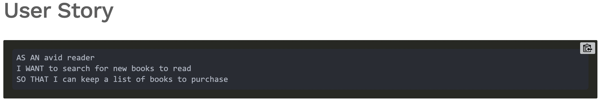
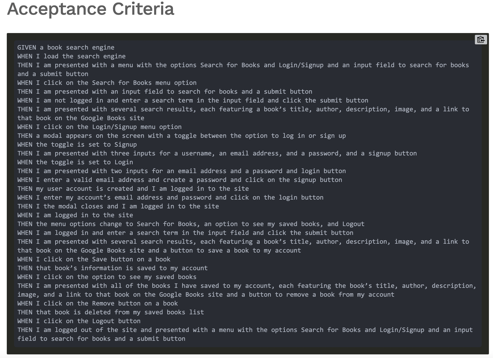

# Book Search Engine Starter Code

# Table of Contents 
* [Description](#description) 
* [Installation](#installation)
* [License](#license)
* [Contributing](#contributing)
* [Questions](#questions)
        
## Description 
This module is emblematic of the fact that most modern websites are driven by two things: data and user demands. This shouldn't come as a surprise, as the ability to personalize user data is the cornerstone of real-world web development today. And as user demands evolve, applications need to be more performant.

This module, you’ll take a fully functioning Google Books API search engine built with a RESTful API, and refactor it to be a GraphQL API built with Apollo Server. The app was built using the MERN stack, with a React front end, MongoDB database, and Node.js/Express.js server and API. It's already set up to allow users to save book searches to the back end.

To fulfill the Challenge, you’ll need to do the following:

* Set up an Apollo Server to use GraphQL queries and mutations to fetch and modify data, replacing the existing RESTful API.

* Modify the existing authentication middleware so that it works in the context of a GraphQL API.

* Create an Apollo Provider so that requests can communicate with an Apollo Server.

* Deploy the application to Heroku.

### User Story 

### Acceptance Criteria 

### Mock Up

## Installation
* npm i
* npm run build 
* npm start
* npm deploy

## License 
MIT license 

## Contributing 
William Wright

## Questions
Reach out to me regarding question at,
* Github: <a href="https://github.com/wrightw404">wrightw404</a>
* Email: <a href="mailto:Wrightw404@gmail.com">Wrightw404@gmail.com</a>
